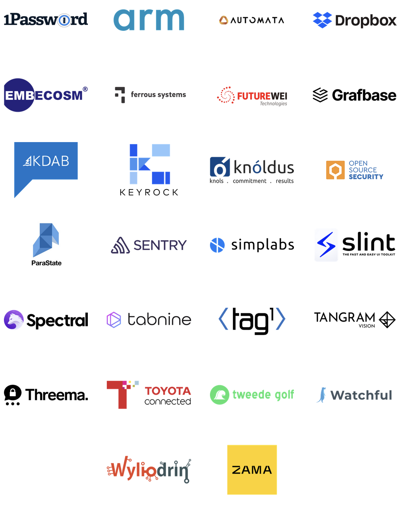

# Why Rust


---


# Rust, a language empowering everyone to build reliable and efficient software.

<div class="grid grid-cols-3 gap-4">
<div>

## Performance
Rust is blazingly fast and memory-efficient:
with no runtime or garbage
collector, it can power performance-critical services, run on embedded
devices, and easily integrate with other languages.

</div>
<div>

## Reliability
Rust’s rich type system and ownership model guarantee memory-safety and
thread-safety —
enabling you to eliminate many classes of bugs at
compile-time.

</div>
<div>

## Productivity
Rust has great documentation, a friendly compiler with useful error messages,
and top-notch tooling — an integrated package manager and build tool, smart
multi-editor support with auto-completion and type inspections, an
auto-formatter, and more.

</div>
</div>

---

## Rust is already widely adopted!

[Rust foundation](https://foundation.rust-lang.org/) platinum members:


---

[Rust foundation](https://foundation.rust-lang.org/) silver members:



---

## Strengths

- Compiled code [about same performance](
https://benchmarksgame-team.pages.debian.net/benchmarksgame/box-plot-summary-charts.html) as C / C++, and excellent [memory and energy efficiency](
https://dl.acm.org/doi/10.1145/3136014.3136031).
- Can [avoid 70% of all safety issues](
https://www.chromium.org/Home/chromium-security/memory-safety) present in C / C++, and most memory issues.
- Strong type system prevents [data races](
https://doc.rust-lang.org/nomicon/races.html), brings ['fearless concurrency'](
https://blog.rust-lang.org/2015/04/10/Fearless-Concurrency.html) (amongst others).
- Seamless C interop, and [dozens of supported platforms](
https://doc.rust-lang.org/rustc/platform-support.html) (based on LLVM).
- ["Most loved language"](
https://survey.stackoverflow.co/2022/#section-most-loved-dreaded-and-wanted-programming-scripting-and-markup-languages
  ) for ~~4~~ ~~5~~ ~~6~~ 7 years in a row. 🤷‍♀️
- Modern tooling: `cargo` (builds _just work_), `clippy` (550+ code quality lints), `rustup` (easy toolchain mgmt).


---

## Weaknesses

- Steep learning curve; compiler enforcing (esp. memory) rules that would be "best practices" elsewhere.
- Missing Rust-native libs in some domains, target platforms (esp. embedded), IDE features.
- Longer compile times than "similar" code in other languages.
- No formal language specification, can prevent legal use in some domains (aviation, medical, …).
- Careless (use of `unsafe` in) libraries can secretly break safety guarantees.

---

## XOR

[**eXclusive OR**] also known as _exclusive disjunction_ is a logical operation that is `true`
if and _only_ if its arguments differ (one is true, the other is false).


---

[aliasing XOR mutability](http://plv.mpi-sws.org/rustbelt/ghostcell/paper.pdf)

Rust’s type system enforces the discipline of aliasing _XOR_ mutability
- (AXM, for short): a value of type `T` may either have *multiple aliases*
(called shared references), of type `&T`, or it may be mutated via a
*unique, mutable reference*, of type `&mut T`
- **BUT** it may not be *both
aliased and mutable* at the same time


---

## `null`


---

## `null` contd.

In computing, a null pointer or null reference is a value saved for indicating
that the pointer or reference does not refer to a valid object. Programs
routinely use null pointers to represent conditions such as the end of a list
of unknown length or the failure to perform some action; this use of null
pointers can be compared to nullable types and to the Nothing value in an
option type.


---

## [`Option`](https://doc.rust-lang.org/std/option/enum.Option.html) type
represents an optional value: every `Option` is either `Option::Some`(contains a value,
or `Option::None`(essentially `null`). `Option`s are used
frequently in Rust with a number of uses:
- Initial values
- Return values for functions that are not defined over their entire input range (partial functions)
- Return value for otherwise reporting simple errors, where None is returned on error
- Optional struct fields
- Struct fields that can be loaned or “taken”
- Optional function arguments
- Nullable pointers
- Swapping things out of difficult situations

---
```rust
//       keyword
//       |      Type of returned value that will be
//       |      | held by `Some(T)`
//       v      v
pub enum Option<T> { // < Body of enum option,
    None,            // | When Option is unwrapped:
    Some(T),         // | it will be either `None`
}                    // < or `Some(T)`
```
--- 
## Could Rust be a good fit for you?

- what is interesting about Rust?
- why do you like Rust?
- what does the borrow checker do in Rust?
- what is the best way to handle nullable types in Rust (hint: talk about the `Option` type)


---

## General Concepts

- Compiled (Rust) vs. Interpreted languages (Python)
- Strong Typing (Rust) vs. Weak Typing (Python)
- [The borrow checker (how does Rust enforce AXM)](https://blog.logrocket.com/introducing-the-rust-borrow-checker/)
- [`null`: The Billion Dollar Mistake](https://www.infoq.com/presentations/Null-References-The-Billion-Dollar-Mistake-Tony-Hoare/)
- Object inheritance (Python) vs. Compositional inheritance (Rust)


